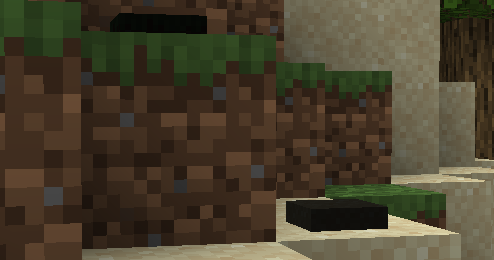
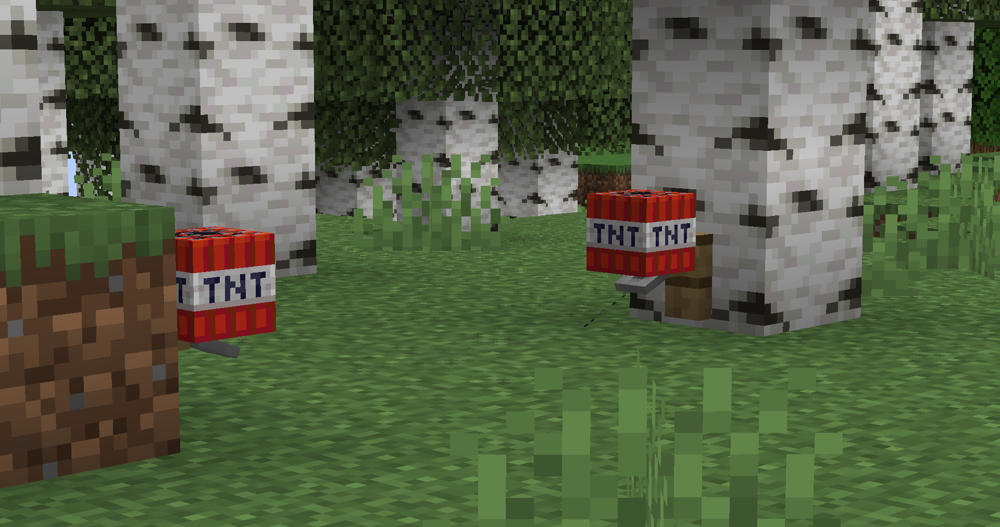

# Hidden mines plugin _2.0_
Plugin adds the mines who can explode.

<table>
  <td></td>
  <td></td>
</table>

# Tested versions
- 1.20
## Advantages
- Plugin works with [_**ProtocolLib**_](https://github.com/dmulloy2/ProtocolLib/)
- Convenient configuration
- Plugin optimized
- Plugin uses **Sqlite** database for save a mines **(Plugin saving a mines only when server disabling)**
## Configuration
You are see a configuration structure:
```yaml
database:
  filename: database.db

mine:
  ground:
    explosionPower: 4
    breakBlocks: false
    recipe:
      ingredients: ["STONE_PRESSURE_PLATE", "TNT"]
      shape: ["X", "Y"]
    localization:
      name: "Ground mine"
      lore: ["This is ground mine", "and she do boooom!"]

  hook:
    explosionPower: 2
    breakBlocks: false
    recipe:
      ingredients: ["TNT", "STONE_BUTTON"]
      shape: ["X", "Y"]
    localization:
      name: "Hook mine"
      lore: [ "This is hook mine", "and she do boooom!" ]
```

#### Database
- `database.filename` - database file name

#### Mine
You can see that structure of mine section is equal, therefore, I will talk about the parameters in a general form.
- `explisonPower` - the explosion power of mine, the greater value, the stronger the explosion
- `breakBlocks` - determines whether the blocks will collapse during the explosion


- `recipe`
  - `ingredients` - names of materials from the [**_Material_**](https://hub.spigotmc.org/javadocs/bukkit/org/bukkit/Material.html) class
  - `shape` - the shape of craft
  

- `localization`
  - `name` the name of item
  - `lore` - the lore of item