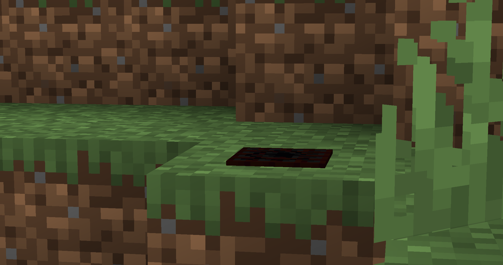

# Hidden mines plugin 
The plugin adds mines that have the ability to explode

### Configuration
The configuration is divided into two parts: **the database and the mines**:
```yml
database:
  filename: "database.db"

mine:
  groundCfg:
    allow: true
    explosionPower: 2.5
    cosmetic: true
    adaptiveCosmetic: true
    breakBlocks: true
    fireBlocks: true

  hookCfg:
    allow: true
    explosionPower: 1.0
    cosmetic: true
    breakBlocks: true
    fireBlocks: true
```
#### The database
`database.filename` - the name for database file

#### The mine
There are 2 types of mines: **groundCfg mines and hookCfg mines**. Both types of mines have similar parameters that perform the **same functionality**
<br><br>
`mine.[groundCfg/hookCfg].allow` - if false, then players are not allowed to craft and place a mine.
<br><br>
`mine.[groundCfg/hookCfg].explosionPower` - the force of the explosion. Be careful, if you write down too large a number then the plugin may disrupt the server.
<br><br>
`mine.[groundCfg/hookCfg].cosmetic` - if true, then the mine will be displayed visually
<br><br>
`mine.groundCfg.adaptiveCosmetic` - if true, then the visual part of the mines will adapt relative to the block on which it is located
<br><br>
`mine.[groundCfg/hookCfg].breakBlocks` - if true, then the blocks will collapse as from a normal TNT explosion
<br><br>
`mine.[groundCfg/hookCfg].fireBlock` - if true, then the blocks can ignite after the explosion

### Commands
`/remove <detonate:[true/false]> <radius> <type:[groundCfg/hookCfg]> <max:optional>` - A command that allows you to remove an array of mines within a given radius

### Recipes of mines
#### Ground
<p>
    
    
</p>

#### Hook
<p>
    
    
</p>